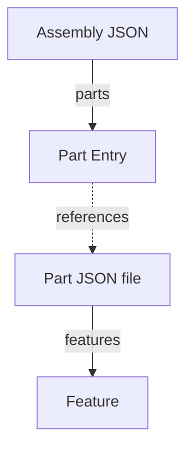
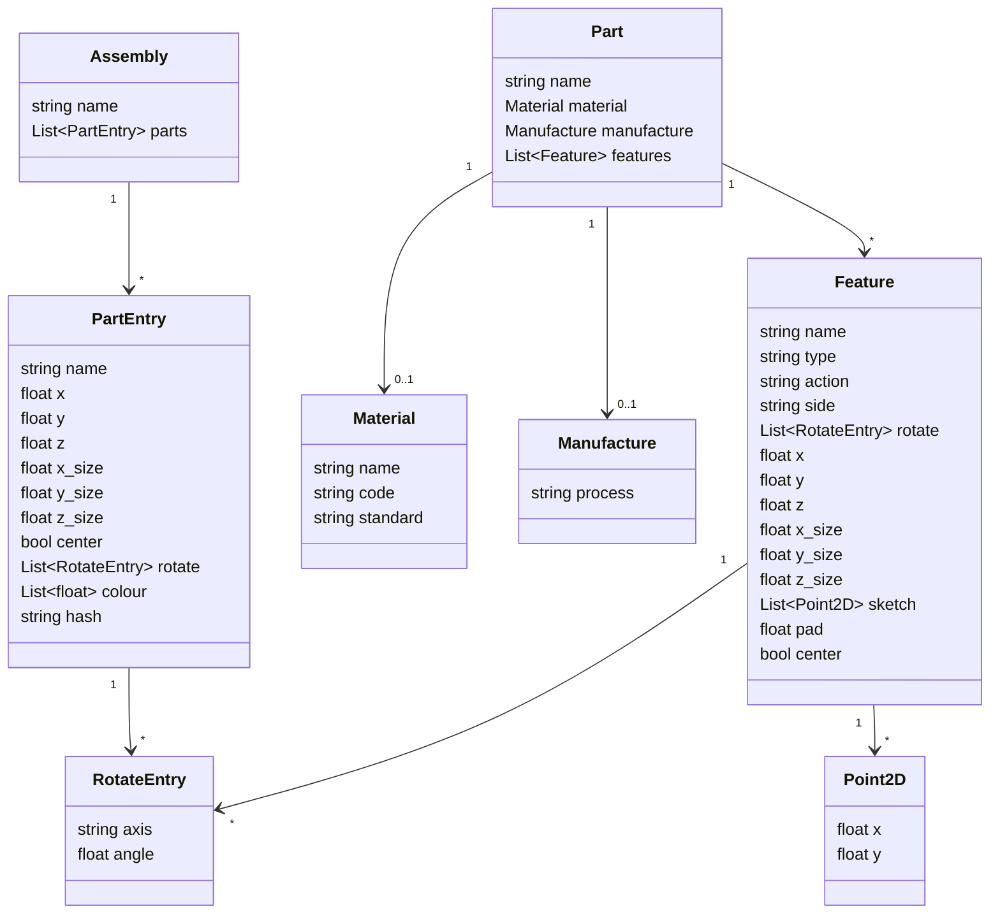

<!--
SPDX-FileCopyrightText: 2026 Tsolo.io

SPDX-License-Identifier: Apache-2.0
-->

# Cycax Data File Specification: Proposed V2

Cycax uses two kinds of JSON file: an **Assembly** file, which arranges parts  in space,
and a **Part** file, which describes an individual part as a base shape
plus a list of features. An engine decides which kind of file it is looking at by checking
whether the JSON has a `parts` list (assembly) or a `features` list (part).



## Verbose by Design

These JSON files have no loops, conditionals, variables, or templating constructs; 
every part in an assembly and every feature on a part is written out explicitly and in full.
Assembly of Assemblies is unfolded into a flat list of parts before being written to disk.
Any repetition, parametrization, or conditional logic (e.g. "add a hole for each item in this
list") happens earlier,
in the Cycax Python layer that generates this JSON (`cycax_part()`,
`cycax_assemble()`, and related functions).
The JSON itself is the fully-resolved output of that code,
not a program to be interpreted. 
This verbosity is a deliberate choice:
it keeps the file format simple and unambiguous for engines to consume,
and pushes all expressive power into Python, where it belongs.

## Field Types and Units

These conventions apply everywhere the field appears, in both Assembly and Part files:

| Field(s)                    | Type              | Units / Range                                   |
| ---------------------------- | ----------------- | ------------------------------------------------ |
| `x`, `y`, `z`                 | float             | millimetres                                      |
| `x_size`, `y_size`, `z_size`  | float             | millimetres                                      |
| `angle`                       | float             | degrees                                          |
| `center`                      | bool              | default `false`                                  |
| `side`                        | string enum       | one of `left`, `right`, `top`, `bottom`, `front`, `back` |
| `colour`                      | array of 3-4 float | `[r, g, b]` or `[r, g, b, a]`, each `0.0`-`1.0`; `a` defaults to `1.0` if omitted |
| `hash`                        | string            | hex string, used for build caching               |
| `rotate`                      | array of `{axis, angle}` | optional; `axis` one of `x`/`y`/`z`, `angle` in degrees. Multiple entries per axis allowed, applied in listed order |

`center` determines whether `x`/`y`/`z` refers to the center of the part/feature or to its
origin corner.

`rotate` tilts the geometry (a part within an assembly, or a feature within a part) about its
own origin, before that geometry is positioned by `x`/`y`/`z`/`center` and, for features,
before `action` is applied. See [Order of Operations](#order-of-operations).

## Assembly JSON Structure

An assembly JSON file describes a flat collection of parts and their arrangement. The Python
authoring layer may nest assemblies within assemblies for convenience, but a nested assembly is
never stored as such in the JSON — it is unpacked into the same flat `parts` list of part
entries before the JSON is written (see [Verbose by Design](#verbose-by-design)). An engine
reading this file never needs to resolve a `parts` entry into another assembly.

```json
{
  "name": "assembly_name",
  "parts": [
    {
      "name": "part_identifier",
      "x": 0.0,
      "y": 0.0,
      "z": 0.0,
      "x_size": 100.0,
      "y_size": 50.0,
      "z_size": 25.0,
      "center": false,
      "rotate": [
        {"axis": "x", "angle": 90.0},
        {"axis": "y", "angle": 90.0}
      ],
      "colour": [0.8, 0.1, 0.05],
      "hash": "3f2a91c7"
    }
  ]
}
```

### Key Fields

- `name`: Unique identifier for the assembly.
- `parts`: Flat array of part entries. A nested assembly is unpacked into this same list
  rather than stored as an assembly entry (see [Verbose by Design](#verbose-by-design)).

    - `name`: Identifier of the referenced part.
    - `x`/`y`/`z`: Coordinate position (see [Field Types and Units](#field-types-and-units)).
    - `x_size`/`y_size`/`z_size`: Dimensions of the referenced part.
    - `center`: If `true`, `x`/`y`/`z` is the center point rather than the origin corner.
    - `rotate`: Optional tilt applied to the part before it is placed (see [Field Types and
      Units](#field-types-and-units)).
    - `colour`: Colour of the part.
    - `hash`: Cache key for the referenced part's build artifacts.

## Part JSON Structure

A part JSON file describes an individual part as a base shape plus a list of features:

```json
{
  "name": "part_identifier",
  "material": {
    "name": "aluminium",
    "code": "6061"
  },
  "manufacture": {
    "process": "cnc"
  },
  "features": [
    {
     "name": "base",
     "type": "cuboid",
     "action": "add",
     "x": 0.0,
     "y": 0.0,
     "z": 0.0,
     "x_size": 200.0,
     "y_size": 100.0,
     "z_size": 2.0
    },
    {
      "name": "top_pocket",
      "type": "cuboid",
      "action": "subtract",
      "side": "top",
      "x": 10.0,
      "y": 10.0,
      "z": -1.0,
      "x_size": 20.0,
      "y_size": 20.0,
      "z_size": 5.0,
      "center": false
    }
  ]
}
```

### Key Fields

- `name`: Unique identifier for the part.
- `material` (optional): Material the part is made from — see [Material](#material).
- `manufacture` (optional): How the part is produced — see [Manufacture](#manufacture).
- `features`: List of feature objects applied to the part.
  - `name`: Identifier for the feature.
  - `type`: The kind of feature (e.g. `cuboid`, `cylinder`, `sketch`). See [Open
    Questions](#open-questions) — the full enumeration is not yet documented here.
  - `action`: How the feature combines with the part. Typically `"add"` or `"subtract"`;
    other values (e.g. a future `"bend"`) may be introduced for feature types that deform the
    part rather than perform a boolean cut/add — see [Bending](#bending).
  - `side`: Side of the part the feature is applied to (see [Field Types and
    Units](#field-types-and-units)).
  - `rotate`: Optional tilt applied to the feature's own geometry before it is positioned and
    combined with the part (see [Field Types and Units](#field-types-and-units)).
  - `x`/`y`/`z`: Coordinate position of the feature, applied after `rotate`.
  - `x_size`/`y_size`/`z_size`: Dimensions of the feature, for primitive feature types.
  - `center`: If `true`, `x`/`y`/`z` is the center point rather than the origin corner.

A feature object can contain additional fields specific to its `type` — for example, a
`sketch`-based feature uses `sketch`/`pad` instead of `x_size`/`y_size`/`z_size` (see [Sketch
and Pad Features](#sketch-and-pad-features)).

### Material

An optional `material` object may be added to a part:

- `name`: Material family, e.g. `"stainless-steel"`, `"aluminium"`.
- `code`: Grade/designation within that family, e.g. `"304"`, `"6061"`.
- `standard` (optional): Which designation scheme `code` follows, e.g. `"AISI"`, `"UNS"`,
  `"DIN"`. Omit if the code is informal or no accepted standard applies (common for plastics).

```json
"material": {
  "name": "stainless-steel",
  "code": "304",
  "standard": "AISI"
}
```

No single standard covers every material family used across 3D printing, CNC, and sheet metal.
The closest recognized numbering systems for metals are UNS (ANSI/SAE, e.g. `S30400` for 304
stainless) and DIN/EN material numbers (Werkstoffnummer, e.g. `1.4301` for the same alloy).
`name` + `code` as informal identifiers, with the optional `standard` field, covers both formal
and informal cases without forcing every material to carry a standard designation.

### Manufacture

An optional `manufacture` object describes how the part is produced:

- `process`: e.g. `"3d-print"`, `"cut-and-bend"`, `"cnc"`. Like feature `type`, the full
  enumeration is open-ended and not yet fixed — see [Open Questions](#open-questions).
- Additional fields are specific to `process` — e.g. `infill` (percentage, `0`-`100`) for
  `"3d-print"`.

```json
"manufacture": {
  "process": "3d-print",
  "infill": 30
}
```

### Order of Operations

A feature's fields are applied in this order:

1. **Geometry** — the feature's base 3D shape: either a primitive (`x_size`/`y_size`/`z_size`)
   or a 2D sketch extruded with `pad` (see [Sketch and Pad Features](#sketch-and-pad-features)).
2. **Rotate** — the optional `rotate` tilt, applied about the geometry's own origin.
3. **Position** — `x`/`y`/`z` (and `center`) place the rotated geometry relative to the part's
   `side`.
4. **Action** — `add`, `subtract`, or another feature-specific action combines the positioned
   geometry with the part.

### Sketch Features

Instead of a primitive `x_size`/`y_size`/`z_size` box, a feature's geometry can be defined by
drawing a 2D profile and extruding ("padding") it into a solid:

- `sketch`: Array of 2D objects (`{"type": "circle", "x": ..., "y": ..., "diameter": ...}` or `{"type": "rectangle", "x": ..., "y": ..., "x_size": ..., "y_size": ...}`) on the feature's local XY plane. Objects are combined in order, so later objects can subtract from earlier ones.
- `z_size`: Float, millimetres. A.k.a Pad. Extrudes the sketch along the local Z axis to produce a solid.

The resulting solid is then rotated (`rotate`), positioned (`x`/`y`/`z`/`center`/`side`), and
combined with the part (`action`) exactly like a primitive feature — see [Order of
Operations](#order-of-operations).

```json
{
  "name": "angled_slot",
  "type": "sketch",
  "action": "subtract",
  "side": "top",
  "sketch": [
    {"type": "circle", "x": 100.0, "y": 25.0, "diameter": 50.0, "action": "add"},
    {"type": "rectangle", "x": 0.0, "y": 20.0, "x_size": 80.0, "y_size": 10.0, "action": "add"},
    {"type": "circle", "x": 100.0, "y": 25.0, "diameter": 10.0, "action": "subtract"},
  ],
  "pad": 12.0,
  "rotate": [
    {"axis": "x", "angle": 30.0}
  ],
  "x": 15.0,
  "y": 15.0,
  "z": 0.0,
  "center": false
}
```

`sketch` is a proposed names, not yet confirmed — see [Open Questions](#open-questions).

### Bending

Bending (e.g. folding sheet metal along a line) is not yet a fully specified feature type, but
this spec is not meant to prohibit it: `type` is open-ended and a feature object may carry
additional type-specific fields, so a bend feature can be added later — e.g. `"type": "bend"`
with its own fields (fold line, angle, direction) — without changing the rest of this
structure. `action` is likewise not restricted to `"add"`/`"subtract"`; a feature type that
deforms the part rather than performing a boolean operation may use a different `action` value
(e.g. `"bend"`) instead.



## Open Questions

- **Valid feature types**: The full list of `type` values (`cuboid`, `cylinder`, ... ) is long
  and still growing. It is not yet enumerated in this spec; deferred for now.
- **`sketch`/`pad` field names**: Proposed for 2D-sketch-then-extrude features (see [Sketch and
  Pad Features](#sketch-and-pad-features)), not yet confirmed.
- **Bend feature schema**: Not yet designed (fold line/axis, angle, direction, which side of the
  fold moves). The current spec is written so it doesn't block adding this later, but the actual
  fields are still open.
- **`material.standard` field**: Proposed so a `code` (e.g. `"304"`) can be disambiguated
  against a real numbering scheme (AISI, UNS, DIN); not yet confirmed.
- **Valid `manufacture.process` values and their process-specific fields**: e.g. `infill` for
  `"3d-print"`. Like feature types, this list is open-ended and not yet enumerated here.
